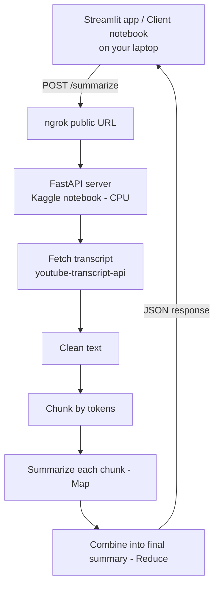

# 🎬 YouTube Video Summarizer

Summarize English YouTube videos using a pre-trained Hugging Face summarization model, served as an API from a **Kaggle notebook running on CPU**, exposed to the internet with **ngrok**, and used from another device through a **Streamlit** web app or a client notebook.

## How it works



### Summarization pipeline
1. **Fetch transcript**: get the video's English captions with `youtube-transcript-api`.
2. **Clean**: remove noise like `[music]`, `>>` and broken caption lines.
3. **Chunk by tokens**: the model accepts only 1024 tokens, so the text is split into ~900-token chunks with a 100-token overlap so ideas aren't cut in half.
4. **Map**: summarize each chunk separately.
5. **Reduce**: combine the chunk summaries and summarize them again into one coherent final summary (repeated recursively for very long videos).
6. The summary length is calculated from the input length, so the model doesn't copy sentences to reach a fixed length.

## Model

`philschmid/bart-large-cnn-samsum`: BART fine-tuned on dialogues (SAMSum dataset).

It was chosen after comparing three models on the same transcript:

| Model | Result |
|---|---|
| `facebook/bart-large-cnn` (original version) | Invented names and facts, because it was trained on CNN news articles |
| `philschmid/bart-large-cnn-samsum` ✅ | No invented facts, understands conversations |
| `pszemraj/long-t5-tglobal-base-16384-book-summary` | Produced unreadable output, and is slower on CPU |

## Project structure

| File | Description |
|---|---|
| `server_notebook.ipynb` | Kaggle notebook: loads the model, runs the summarization pipeline, and serves it as a FastAPI API through ngrok |
| `client_notebook.ipynb` | Sends a video URL to the API and prints the summary |
| `app.py` | Streamlit web app for the same client |
| `requirements.txt` | Libraries needed to run the Streamlit app |

## How to run

### 1. Start the server (Kaggle)
1. Upload `server_notebook.ipynb` to Kaggle.
2. In the notebook settings, set **Accelerator: None** (CPU) and turn **Internet on**.
3. Get your auth token from [ngrok](https://dashboard.ngrok.com) and put it in `NGROK_TOKEN`.
4. Run all cells. The last cell prints the public URL:
   ```
   Your public URL: https://xxxx.ngrok-free.dev
   ```
5. Keep the notebook running while you use the app.

### 2. Use the Streamlit app (on another device)
```bash
pip install -r requirements.txt
```
Set `API_URL` in `app.py` to your ngrok URL followed by `/summarize`, then run:
```bash
streamlit run app.py
```
Open `http://localhost:8501`, paste a YouTube link, and click **Summarize**.

### Or use the client notebook
Set `URL` to your ngrok URL followed by `/summarize`, and run the cell.

## API

`POST /summarize`

Headers:
```
Authorization: Bearer <API_KEY>
Content-Type: application/json
```

Body:
```json
{ "url": "https://www.youtube.com/watch?v=VIDEO_ID" }
```

Response:
```json
{
  "video_id": "VIDEO_ID",
  "summary": "Final summary of the whole video...",
  "sections": ["Summary of part 1...", "Summary of part 2..."]
}
```

## Limitations
- Works with **English** videos that have English captions (manual or auto-generated).
- Runs on CPU, so long videos can take several minutes. Short videos are much faster.
- The model doesn't know who is speaking, so it may attribute the host's words to the guest.
- Sponsor segments inside the video can appear in the summary.
- Kaggle stops idle sessions. If the app shows a 404 error from ngrok, restart the server notebook.
